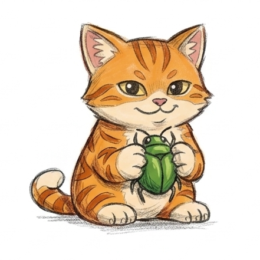

# Catchy.Assertions



Async-native fluent assertion library for .NET — real soft assertions,
observability hooks, and source-generator-powered typed surfaces.

[](https://www.nuget.org/packages/Catchy)
[](https://github.com/olesme/catchy/actions/workflows/ci.yml)
[](LICENSE)

```sh
dotnet add package Catchy
dotnet add package Catchy.XUnit   # or .NUnit / .MSTest / .TUnit / .Reqnroll
```

## Quick look

```csharp
using static Catchy.Stateless;

await Assert.That(user.Name).IsNotNull();
await Assert.That(order.Total).IsGreaterThan(0m).Because("free orders go through promotions");
await Assert.That(tags).Contains("urgent").And().HasCount(3);
```

Soft assertions — all failures collected, reported together:

```csharp
using static Catchy.AmbientSoft;

await Verify.That(order.Id).IsGreaterThan(0);
await Verify.That(order.Total).IsGreaterThan(0m);
await Verify.That(order.Status).IsNotEmpty();
```

Soft and hard assertions plus flush

```csharp
using static Catchy.Ambient;

await Assert.That(order.Id).IsGreaterThan(0);
await Assert.Soft.That(order.Total).IsGreaterThan(0m);
await Verify.That(order.Status).IsNotEmpty();
await Assert.That().SoftState().HasNoErrors(); // Explicit flush (automatic flushing is available via runner-specific packages)
```

## Why Catchy?

- **Async-native.** Every chain is `await`ed — attach logs, traces, or AI/spec-driven
  output via async hooks with no threading workarounds.
- **Real soft assertions.** Not scoped exception aggregation. Interleave soft and hard
  assertions; pass failure state across helpers and step definitions via ambient, DI,
  or explicit instance.
- **No IntelliSense pollution.** `Assert.That(value)` — not `.Should()` on every type.
- **Source-generator extensibility.** Add `[Assertable]` to your type, get a full
  typed assertion surface generated. No boilerplate.
- **Trailing modifiers.** `.Because("reason").IgnoringCase()` after the assertion —
  reads like a sentence.
- **Conflict-free aliases.** Built-in `Check` / `Verify` and support for custom ones.
- **MIT, permanently.**

## Status

Early-stage, pre-1.0. The API will change.
[Open a Discussion](https://github.com/olesme/catchy/discussions) before writing code
so direction is agreed first. Issues and PRs are very welcome.

## Documentation

- [Usage guide](docs/USAGE_GUIDE.md)
- [Architecture](docs/ARCHITECTURE.md)
- [Source generation](docs/SourceGenerator_Architecture.md)
- [Extensibility guide](docs/extensibility-guide.md)
- [Integration tutorial](docs/integration-extension-tutorial.md)
- [Contributing](CONTRIBUTING.md)

## Repository layout

- `src/` — production packages
- `tests/` — automated tests and NuGet smoke validation
- `samples/` — runnable example projects
- `docs/` — canonical documentation
