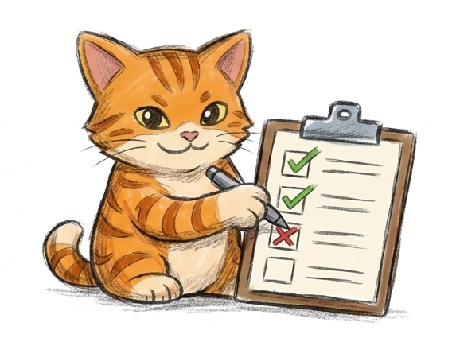

# Quality Gates

This document defines quality gates for Catchy core and integration packages.

## 1. Build and static quality

- Solution build passes on CI.
- No new warnings/errors introduced by package changes (or explicitly justified and tracked).
- Public API additions include XML docs where project style expects them.

## 2. Test quality

Required per package change:

- unit/integration tests for new assertions,
- negative-path tests with expected failure behavior,
- chain rendering and modifier interaction tests when applicable.

Use pass/fail checklist expectations explicitly in tests; do not blur success and failure-path assertions.

## 3. Packaging quality

- `dotnet pack` succeeds for changed package projects.
- package contains expected runtime/build assets.
- no accidental dependency regressions in nuspec/package layout.

## 4. Package-consumption quality

- NuGet consumption path is validated from local package feed.
- Source generation behavior works via package-delivered analyzer assets (no manual consumer analyzer wiring).
- smoke consumer project compiles successfully with package references only.

## 5. Documentation quality

For any behavior or packaging change:

- update canonical docs in same PR/commit group,
- keep docs current-state and publish-ready,
- avoid introducing status snapshots into canonical docs.

Canonical docs:

- `docs/readme.md`
- `docs/USAGE_GUIDE.md`
- `docs/ARCHITECTURE.md`
- `docs/SourceGenerator_Architecture.md`
- `docs/extensibility-guide.md`
- `docs/integration-extension-tutorial.md`
- `docs/integration-catalog.md`
- `CONTRIBUTING.md`

## 6. CI gate recommendation (minimum)

1. restore
2. build
3. targeted test gate (core + source generator suites)
4. pack changed packages
5. build NuGet smoke project from local feed
6. markdown lint + docs sanity checks

## 7. Local pre-commit quality gate (recommended)

Keep local gates fast and deterministic:

1. markdown lint on canonical docs
2. `dotnet build CatchyAssertions.slnx -m:1`
3. targeted tests for touched areas

Optional local tooling:

- Husky.NET for pre-commit / pre-push hooks,
- SonarLint in IDE for early static feedback.

Current Husky local gates in this repository:

- pre-commit: markdown lint + fast build
- pre-push: `CatchyCoreTests` + `CatchySourceGenTests`

Manual equivalent:

- `powershell -ExecutionPolicy Bypass -File ./scripts/quality-local.ps1`

## 8. Version-aware quality expectations

- `0.0.x` to `<0.5.0`: cleanup/breaking changes allowed, but docs/tests/CI must stay green.
- `0.5.x` to `<1.0.0`: deprecate first (`[Obsolete]`), include migration notes.
- `1.0.0+`: compatibility-first policy; removals only in planned major waves.

Repository process templates:

- Integration proposal issue: `.github/ISSUE_TEMPLATE/integration-package.yml`
- Integration bug/regression issue: `.github/ISSUE_TEMPLATE/integration-bug.yml`
- PR quality checklist: `.github/pull_request_template.md`

## 9. Release-readiness gate (before publishing package)

- package metadata validated,
- changelog/release notes prepared,
- compatibility sanity run completed for key target frameworks,
- smoke consumption path green in CI.

## 10. Backlog

- Add a BenchmarkDotNet comparison project for assertion-overhead tracking.
- Compare Catchy against: xUnit, NUnit, TUnit, NFluent, AwesomeAssertions, and Shouldly.
- Exclude FluentAssertions from benchmark scope by repository decision.
- Track both execution time and allocations for representative pass/fail and async assertion flows.
- Keep benchmark execution as non-blocking (manual/nightly), not a mandatory PR gate.
